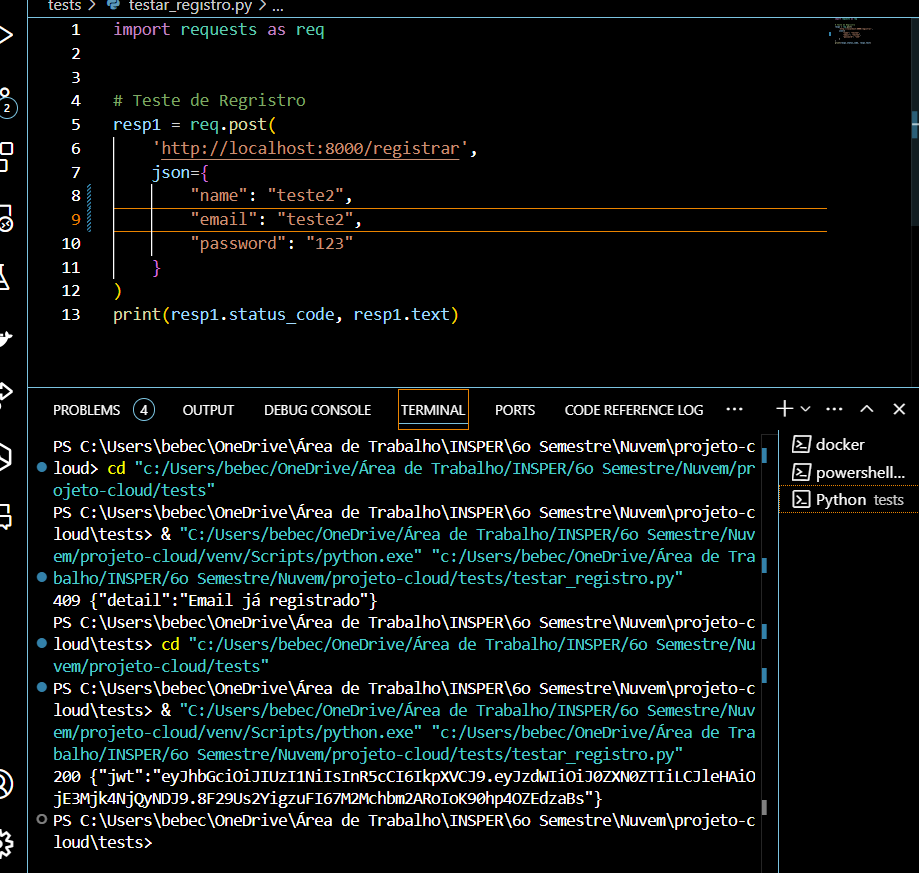
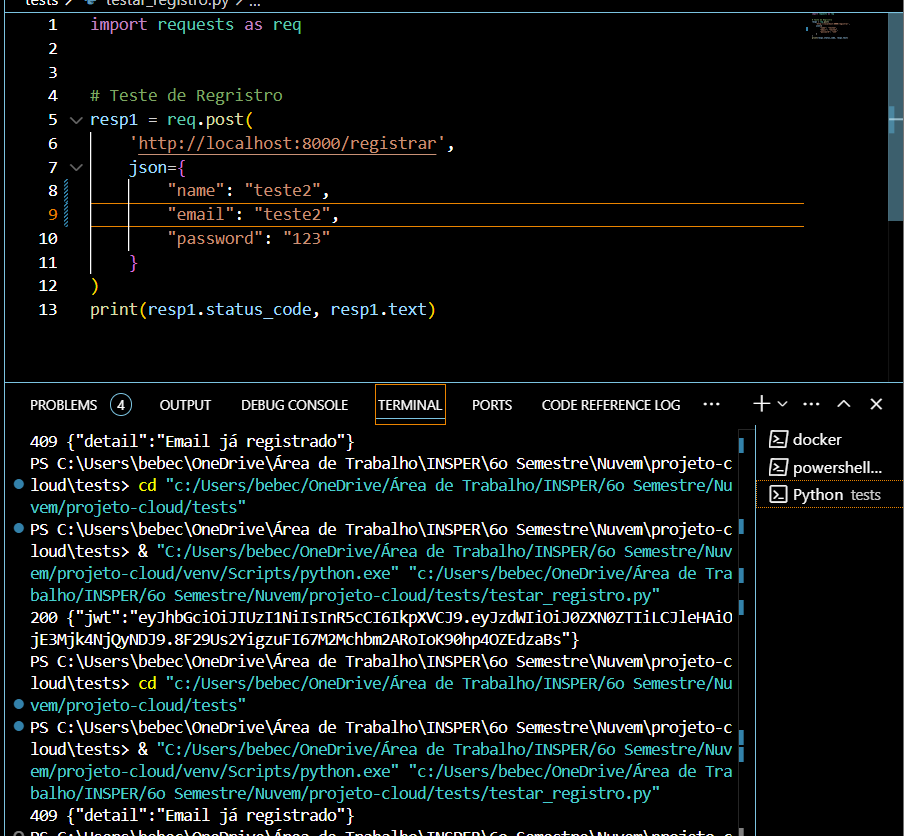
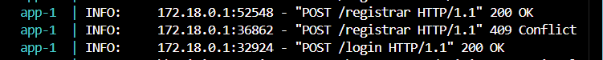
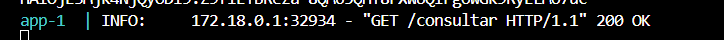

# 🎯 Projeto de API RESTful com Scraping de Dados - Fatos Aleatórios

**Desenvolvido por: Beatriz Borges Zackiewicz**  
**Docker Hub: https://hub.docker.com/r/beatrizbzack/projeto-cloud-app/tags**

  
<!-- Adicione uma imagem representativa do projeto -->

---

## 📖 Visão Geral

Este projeto envolve a criação de uma **API RESTful** para fornecer dados obtidos via **scraping**. A aplicação foi desenvolvida utilizando **FastAPI** e utiliza **POSTGRES** como base de dados. Toda a infraestrutura está conteinerizada com **Docker**, permitindo uma fácil replicação do ambiente.

- **Frameworks**: FastAPI, Pydantic
- **Banco de Dados**: Postgres
- **Scraping**: Requests
- **Deploy**: Docker, Docker Hub

---

## 📚 Documentação Completa

A documentação oficial está hospedada no **GitHub Pages**, gerada automaticamente pelo **MkDocs**. Acesse o link abaixo para visualizar a versão completa:

[📄 Documentação Oficial do Projeto](https://seu-usuario.github.io/seu-projeto)

---

## 📂 Estrutura do Projeto

```markdown
## 📂 Estrutura do Projeto

```bash
.
├── app
│   ├── __pycache__
│   │   └── __init__.py
│   ├── auth.py
│   ├── db.py
│   ├── Dockerfile
│   ├── main.py
│   ├── models.py
│   ├── requirements.txt
│   ├── routes.py
│   ├── schemas.py
│   ├── scraping.py
│   ├── services.py
├── assets
├── db
├── tests
│   ├── test_auth.py
│   ├── testar_api.py
│   ├── testar_registro.py
├── venv
├── .env
├── .env.example
├── .gitignore
├── docker-compose.yml
├── lala.py
└── README.md

```
--- 
## Endpoints da API
### **Registrar Usuário**

- **URL**: `/registrar`
- **Método**: `POST`
- **Descrição**: Cria um novo usuário e retorna um token JWT para autenticação.
- **Parâmetros de Requisição**:
  - **Body** (JSON):
    ```json
    {
      "name": "string",
      "email": "string",
      "password": "string"
    }
    ```
- **Resposta**:
  - **Status**: 200 OK
  - **Body** (JSON):
    ```json
    {
      "jwt": "token_jwt_gerado"
    }
    ```
- **Códigos de Erro**:
  - `409 Conflict`: Email já registrado.

### **Login**

- **URL**: `/login`
- **Método**: `POST`
- **Descrição**: Autentica o usuário e retorna um token JWT para acesso aos endpoints protegidos.
- **Parâmetros de Requisição**:
  - **Body** (JSON):
    ```json
    {
      "email": "string",
      "password": "string"
    }
    ```
- **Resposta**:
  - **Status**: 200 OK
  - **Body** (JSON):
    ```json
    {
      "jwt": "token_jwt_gerado"
    }
    ```
- **Códigos de Erro**:
  - `401 Unauthorized`: Credenciais inválidas.

### **Consultar Fato Aleatório (Protegido)**

- **URL**: `/consultar`
- **Método**: `GET`
- **Descrição**: Retorna um fato aleatório, acessível apenas para usuários autenticados via JWT.
- **Cabeçalho de Autenticação**:
  - `Authorization`: `Bearer {token_jwt}`
- **Resposta**:
  - **Status**: 200 OK
  - **Body**: Resposta da API de fatos aleatórios (o conteúdo pode variar).
- **Códigos de Erro**:
  - `403 Forbidden`: JWT ausente ou inválido.

## Autenticação

Para acessar o endpoint `/consultar`, o usuário precisa de um token JWT, que pode ser obtido no endpoint `/login`. O token deve ser enviado no cabeçalho de autenticação da requisição com o formato:

Authorization: Bearer {token_jwt}

--- 
## Configuração

### Rodar a API pelo terminal
Para configurar e rodar a API, instale as dependências e execute o servidor:

```bash
# Rode o docker compose dentro da raiz do projeto
docker compose up
 
``` 

Para testar a API, rode os scripts em python em ordem:
- ``testar_registro.py`` para criar um novo usuário
- ``testar_api.py `` para testar o login e a consulta do fato aleatório

Ou:
- Direto pelo terminal do seu sistema operacional com os comandos de request de acordo com cada endpoint que deseja testar (consultar tópico de endpoints)

---
# Screenshots da API e Vídeo Demonstrativo
--- 
## /resitrar
Teste de registro de novo usuário:
  

Teste de tentativa de cadastro de usuário já existente:
  

## /login e /consultar
Teste de login e consulta de fato aleatório:
  

## Terminal do Docker




## Vídeo:
